# DreamCurve — KeeperHub Earn + dreamDEX Arena

## Current hackathon direction: Aave V3 on Sepolia

The user approved **DreamCurve Earn → KeeperHub → Aave V3** on Ethereum Sepolia
11155111 instead of waiting for hosted Somnia support. Open `/app/earn` for the
new supply/withdraw flow. New intents use Aave test LINK (18 decimals), because
the test USDC reserve exceeded its supply cap at the audit. Old USDC intents stay unchanged. The original Arena/dreamDEX path remains on Somnia.
See [Earn setup, funding and safety](docs/EARN_GUIDE.md); run `npm run earn:doctor`.

Earn uses manually reviewed deterministic intents; it does not claim a new AI
yield model. Broadcasts default to locked pending free-tier confirmation and
testnet funding. Real Aave execution proof is still required before submission.

## Existing dreamDEX integration (preserved)

Agents decide. KeeperHub executes. dreamDEX settles.

DreamCurve compares BTC/ETH Event Contract forecasts, freezes a reviewed trade
into a deterministic execution intent, and routes simulation and execution through
KeeperHub. The executing organization wallet owns the collateral and positions.
The operator's browser wallet signs an authorization message for the exact intent.

**Current status: integration implemented; live KeeperHub → dreamDEX proof is
still blocked on deployment prerequisites. This is not submission-ready.**
At the initial live audit (2026-09-08), hosted KeeperHub listed 24 chains without
Somnia Shannon 50312. No real execution ID, transaction link or demo video is
claimed. Run the doctor to check the current endpoint instead of relying on this
historical observation.

## Project history

DreamCurve was built for the Somnia × DreamDEX Event Contracts Hackathon.
The prior version is frozen at `dreamdex-hackathon-v1`, commit
`4655455e573a64b6d9e1cc46150b6c2bc6fa7453`. KeeperHub work is isolated on
`keeperhub-integration`; it has not been merged into main.

Existing work: Arena, BTC/ETH discovery, quantitative agent forecasts, chart,
scorecard, browser-wallet trading and portfolio. The agents currently use
transparent quantitative rules, not an LLM. New work: frozen intents, KeeperHub
adapter, signed authorization, bounded approvals, preflight, durable execution
claims, independent transaction verification, execution history and audit UI.

## Architecture

```mermaid
flowchart LR
  A[Quantitative recommendation] --> B[Server freezes intent and hash]
  B --> C[User reviews exact payload]
  C --> D[KeeperHub dry run]
  D --> E[Operator signs authorization]
  E --> F[Final preflight and durable claim]
  F --> G[KeeperHub contract execution]
  G --> H[dreamDEX on Shannon]
  H --> I[Independent receipt and order verification]
```



React/Vite + Express + viem + `@somnia-chain/markets-sdk` 0.29.0. SQLite is used
locally; `DATABASE_URL` enables the existing Postgres store. Both persist intent
and execution metadata. Intents are insert-only; updates affect metadata only.
No private key is needed in DreamCurve. KeeperHub handles transaction signing.

## Run

Use Node 22.13+ (node:sqlite required; verification also uses Node 24) and npm.

```sh
npm ci
# Create .env from .env.example and configure the values below.
npm run keeperhub:doctor
npm run dev
```

Open `http://127.0.0.1:8787/app` for live markets, `/app?mode=demo` for the existing
illustrative Arena, and `/app/executions` for connectivity and real audit records.
Illustrative markets cannot create live execution intents.

Production: `npm run build` then `npm start`. Set `HOST`/`PORT` for your host and
use a durable `DATABASE_PATH` volume or `DATABASE_URL`. Do not deploy the SQLite
audit database on ephemeral storage. Keep existing forecast data when migrating.

## KeeperHub configuration

All variables below are server-only; never prefix secrets with `VITE_`.

| Variable | Meaning |
| --- | --- |
| KEEPERHUB_BASE_URL | Real hosted or self-hosted KeeperHub endpoint |
| KEEPERHUB_API_KEY | Organization key; dry-run needs read scope, broadcast needs write scope |
| KEEPERHUB_WALLET_ADDRESS | Actual KeeperHub organization EOA, confirmed with its wallet API |
| KEEPERHUB_OPERATOR_ADDRESSES | Comma-separated browser wallets allowed to authorize intents |
| KEEPERHUB_SIGNER_MODE | `eoa` after verifying writes do not route through a Safe |
| KEEPERHUB_AUTHORIZATION_DOMAIN | Unique application/deployment domain in signed messages |
| SOMNIA_RPC_URL | Shannon HTTP RPC used for independent verification |
| SOMNIA_WS_RPC_URL | Shannon WS RPC used by existing SDK reads |
| DREAMDEX_INDEXER_URL | Current dreamDEX indexer, used for dynamic discovery |

`npm run keeperhub:doctor` performs only read operations, separately checking
public chain support, authenticated organization wallet, operator configuration,
RPC chain ID and funding. Chain catalog access alone does not prove authentication.

Fund the **KeeperHub wallet** with Shannon STT and the tUSDC collateral from the
current SDK configuration. Existing browser faucet tools fund the browser wallet,
not automatically the KeeperHub wallet. Obtain STT through Somnia's current
testnet faucet and transfer test collateral to the executing wallet as needed.
Token decimals are read onchain. No mainnet trading is enabled.

See [Somnia support investigation](docs/KEEPERHUB_SOMNIA_SUPPORT.md) for the
verified hosted blocker and the required self-hosted/source changes.

## Dry-run and execute

1. Connect an allowlisted operator wallet on Shannon. Select a live market in Arena.
2. Choose a side or copy a current model recommendation. Prepare an execution
   with a maximum stake up to 1 tUSDC (or a lower configured cap). The server resolves the pool, quote and
   collateral from live SDK reads, with a 2% protective limit on the tick/lot grid.
3. Review the executing wallet, token, side, amount, expiry, encoded call and hash.
4. Run KeeperHub dry run. Missing allowance exposes a separate **bounded approval**
   intent. Review, simulate and explicitly sign that approval through KeeperHub.
   Return to the original trade and simulate it again. If expired, create a new intent.
5. Check the review confirmation and click Execute with KeeperHub. Sign the
   authorization message. The server verifies it and rechecks the *same* payload
   before persisting its broadcast claim and asking KeeperHub to execute.
6. Keep the execution URL. Polling follows KeeperHub hints with backoff. SUCCESS
   requires a verified KeeperHub receipt plus independent RPC transaction/calldata
   and dreamDEX event verification. Open the real explorer link when available.

The old direct-wallet modal remains accessible through an explicitly labeled
legacy action. It does not qualify as the KeeperHub demo path.

## Safety and recovery

- Funding is read from the KeeperHub executor, verified against active market
  collateral and SDK configuration. The review displays exact STT/tUSDC balances,
  gas reserve, per-trade cap and remaining durable demo budget. See
  [funding and limits](docs/KEEPERHUB_FUNDING_AND_LIMITS.md) for manual funding steps.
- Default ceilings are 1 tUSDC/trade and 5 tUSDC cumulative attempted/reserved
  trade budgets per executor in the audit database. Limits may be lowered through
  server configuration. Reloading the browser or restarting the server does not
  reset them. Bounded approvals are not counted twice; attempted trade budgets
  are conservatively retained even when the transaction fails or has no fills.
- No model runs during execution, and there is no silent requote or expiry refresh.
- Mandatory checks fail closed for stale intent, closed market, wrong chain/token/
  wallet, insufficient funding/allowance, grid violations and simulator failures.
- Approval and order each require their own reviewed, simulated, signed intent.
- Signatures bind the deployment domain, unique intent ID/hash, wallet and expiry.
- A database compare-and-swap plus unique in-flight wallet index prevents concurrent
  submissions across server instances. KeeperHub also receives a stable intent-hash
  idempotency key. Its documented retention is 24 hours; DreamCurve keeps the claim.
- An interrupted response never automatically rebroadcasts. If an execution ID was
  lost, retrieve it from KeeperHub's real audit log and use the signed recovery UI.
  Recovery must independently match an existing onchain transaction to the intent.
- If a process dies after claiming EXECUTING but before recording a broadcast
  attempt, refreshing after the intent expires marks it STALE and releases the
  wallet lock. A competing preflight cannot subsequently pass its final database
  claim. Records with an attempted broadcast remain locked until reconciled.
- KeeperHub's documented Safe simulation sender mismatch is not supported.
  Verify EOA routing when configuring the organization; do not change routing during a run.
- Public audit endpoints disclose intent parameters and wallet addresses; saved
  authorization signatures and organization credentials are not returned.

## Verification

```sh
npm run typecheck
npm test
npm run build
npm run test:e2e
npm run keeperhub:doctor
```

Unit/integration tests use explicit test doubles and temporary SQLite databases,
never live funds. Browser tests use intercepted API fixtures for failure/review
states, not production mock modes. A test pass is not evidence of live execution.

## Known limitations

- Real KeeperHub → dreamDEX transaction, funded organization connection and demo
  video remain outstanding. Hosted Somnia support was absent at initial audit.
- EOA organizations and allowlisted operators only; multi-tenant wallet ownership
  and Safe execution are not implemented.
- BUY YES/NO IOC orders only. A confirmed transaction can have no fills;
  PLACED/RESTING/PARTIALLY_FILLED/FILLED are derived from actual receipt events.
- Approval can consume the remaining intent lifetime; create a new reviewed trade
  when necessary. Approval never causes the trade to execute automatically.
- KeeperHub order history is in Executions. The existing Portfolio follows the
  connected browser wallet and does not yet manage the organization wallet's positions.
- Forecast agents remain the original quantitative baselines. LLM integration is
  not claimed as new work or silently added.
- SQLite persistence is tested; the Postgres adapter requires a provisioned database
  for live integration testing. New tables use the existing database connection.

Submission material: [audit](docs/KEEPERHUB_INTEGRATION_AUDIT.md),
[submission draft](docs/HACKATHON_SUBMISSION.md),
[live demo checklist](docs/LIVE_DEMO_CHECKLIST.md).

API contracts were checked against the [official KeeperHub Direct Execution API](https://docs.keeperhub.com/api/direct-execution)
and [Chains API](https://docs.keeperhub.com/api/chains), plus official staging source
`f3d7e70798512b0dc2fcc721d0e99da08c5fedff`. Recheck current runtime schemas before a final submission.
