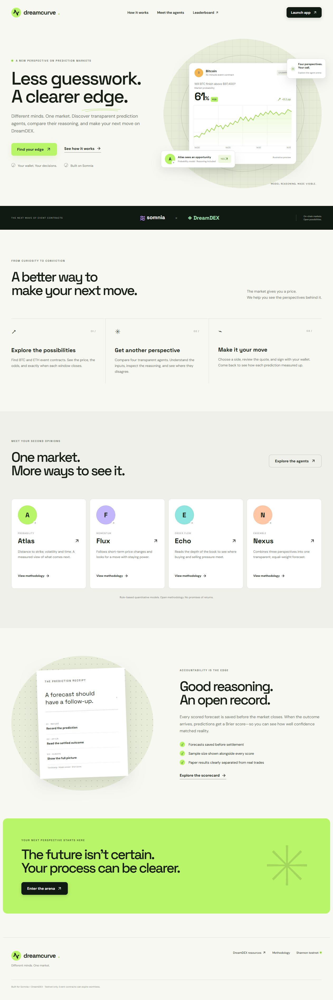
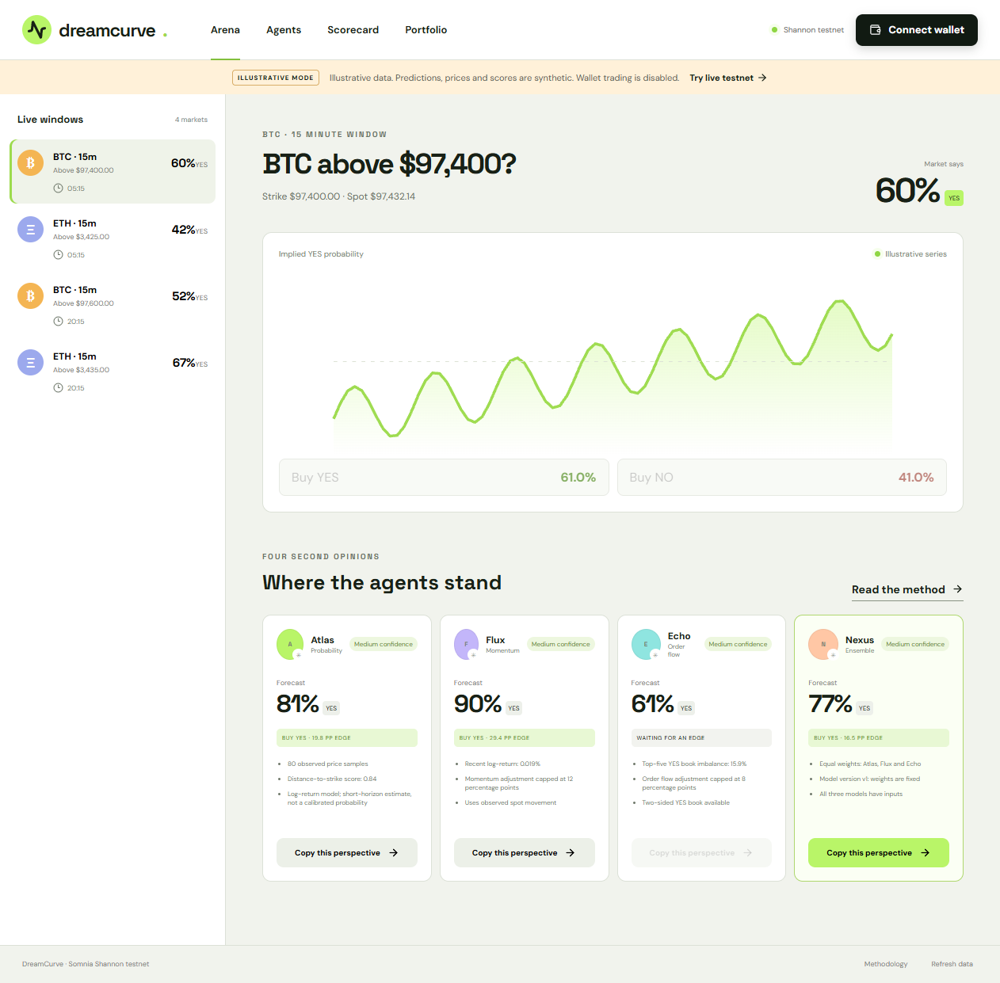
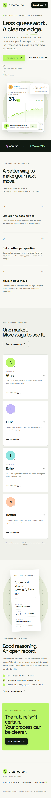
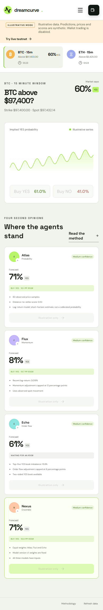
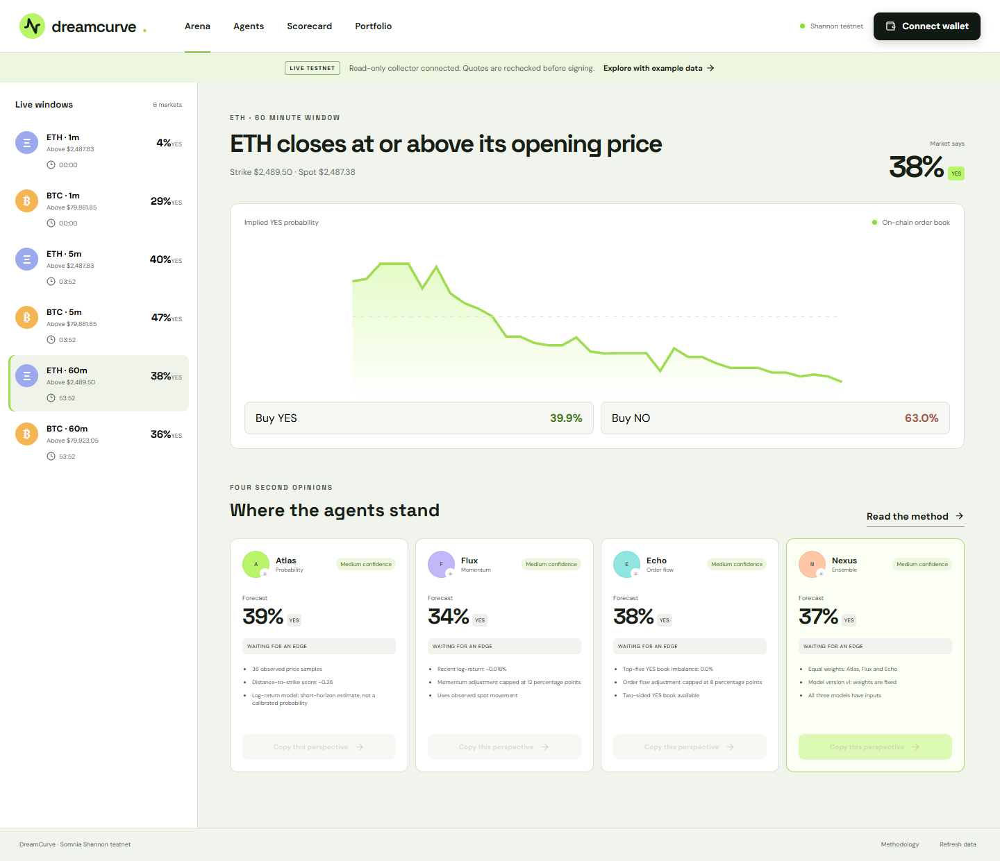

# DreamCurve

**Different minds. One market.** DreamCurve turns DreamDEX Event Contracts into an explainable agent arena: compare four reproducible forecasts, inspect their inputs, copy a perspective into a non-custodial testnet trade, and score every canonical prediction after settlement.

Built for the Somnia × DreamDEX Event Contracts Hackathon.

**Live app:** [dreamcurve-somnia-155519b47159.herokuapp.com](https://dreamcurve-somnia-155519b47159.herokuapp.com/)

## What works

- Editorial landing page and responsive application shell.
- Live Shannon testnet discovery for BTC/ETH Event Contracts.
- On-chain status, order-book, tick/lot and expiry reads through `@somnia-chain/markets-sdk` `0.29.0`.
- Current spot feed and fixed/reference strike handling.
- Atlas probability model, Flux momentum model, Echo order-flow model and equal-weight Nexus ensemble.
- Freshness, status, data-sufficiency and expiry-headroom gates.
- Browser-wallet BUY YES/NO flow with a depth-aware SDK quote, exact integer stake, tick/lot alignment, a short order lifetime and receipt validation.
- Wallet portfolio, order cancellation and batch redemption.
- Immutable canonical forecast rows, SHA-256 export, settlement scoring, Brier score and paper PnL.
- Clearly separated illustrative mode for judging when no live liquidity is available.

## Product tour

| Landing page | Agent arena |
| --- | --- |
|  |  |

| Mobile landing | Mobile arena |
| --- | --- |
|  |  |



## Run locally

Requirements: Node.js 22.13+ and an EVM browser wallet for transactions.

```bash
npm install
copy .env.example .env
npm run doctor
npm run dev
```

Open `http://127.0.0.1:8787`. Read-only views need no wallet. Trading requires Shannon testnet (chain `50312`), STT for gas and the market's collateral token.

The public endpoints in `.env.example` are the SDK's current Shannon defaults. `DREAMDEX_VENUE_ID` is optional because venue IDs can move; discovery is narrowed to active BTC/ETH markets and every write re-checks its market by bytes32 market ID.

## Commands

```bash
npm run doctor       # read-only chain/indexer/order-book smoke test
npm run typecheck
npm test
npm run build
npm run test:e2e
npm start            # serve the production build + collector
```

## Deploy on Heroku

The repository includes a `Procfile`, binds to Heroku's injected `PORT`, and selects `0.0.0.0` automatically when `DYNO` is present. The Node build creates `dist`, then `npm start` serves the app and runs the collector.

For durable scoring, attach Heroku Postgres. Its automatically managed `DATABASE_URL` takes priority over local SQLite. Use one web dyno; no worker or server signer is required. Without Postgres, the app can use `DATABASE_PATH=/tmp/dreamcurve.sqlite` for a temporary preview, but records disappear after a dyno restart.

```bash
heroku config:set COLLECTOR_ENABLED=true --app <app-name>
heroku addons:create heroku-postgresql:essential-0 --app <app-name>
git push heroku main
```

The database add-on is paid. Do not provision it without reviewing the current Heroku price. Never set a private key: users sign all writes in their browser wallet.

Current deployment: `dreamcurve-somnia`, Heroku-24, one Eco web dyno. It uses temporary SQLite until a Heroku Postgres plan is explicitly approved and attached.

## Deploy on Railway

The repository includes `railway.json` and pins Node 22.13 in `.nvmrc`. Create a persistent volume, mount it into the service, set `DATABASE_PATH` to a file inside that mount, then deploy. Railway uses `/api/health` as the health check. No private key belongs in the deployment environment: all write transactions are signed in the user's browser wallet.

## Data flow

```text
DreamDEX indexer ── discovery / portfolio / resolution history
        │
Somnia RPC + WS ── on-chain status / book / live watches
        │
Price-feed indexer ── BTC/ETH spot observations
        ▼
Read-only collector ── snapshots ── deterministic agents
        │                              │
        │                         canonical forecast
        │                              │
        └──────────────────────── SQLite/Postgres scorecard
                                       │
Browser wallet ── fresh quote ── signed Event Contract order
```

The server has no private key. It cannot trade for a user. The browser creates a wallet-backed SDK trader only after connection.

## Forecast record and scoring

The collector stores at most one forecast per agent and market during the final 20% of a window, capped at 60 seconds. A database primary key and update trigger make it immutable to normal application writes. The export digest helps compare a record; it is not an on-chain timestamp proof and cannot prevent a database administrator from rewriting storage.

`Brier = (predicted YES probability - outcome)²`, where YES is `1`. Lower is better. Paper PnL assumes one outcome share bought at the captured executable ask, before protocol fees and gas. It does not claim a fill. Sample counts appear beside all scores.

## Transaction safety

- Live mode only; example data can never enter a trade call.
- Network must be Somnia Shannon (`50312`).
- The market is read from chain immediately before quoting and again before signing.
- A trade is blocked for stale data, closed markets or insufficient expiry headroom.
- The SDK sizes stake against current depth and aligns price/quantity to the pool grid.
- Orders use Immediate-Or-Cancel with a short expiry.
- The UI only reports confirmation when the mined receipt succeeds, and tells the user whether any fills were decoded.
- Open orders are visible and cancellable; settled winning positions can be redeemed.

## Known limits

- The v1 agents are transparent quantitative baselines. They are not trained machine-learning models and do not promise profit.
- Nexus uses equal weights in v1. The UI and methodology say this explicitly.
- The indexer's strike/opening-answer scale is currently an empirical two decimals, as documented in SDK source; adapter resolution answers may use a different scale.
- SQLite needs persistent storage in production. Mount the path in `DATABASE_PATH` on Railway or replace the adapter with Postgres.
- A real wallet transaction cannot be automated in CI without a funded test account. `npm run doctor` validates the live read path without signing.

## Project map

- `src/App.tsx` — landing page and methodology.
- `src/Arena.tsx` — Arena, Agents, Scorecard and Portfolio UI.
- `src/wallet-bridge.ts` — lazy wallet boundary; keeps the SDK out of initial page bundles.
- `src/wallet.ts` — wallet connection, quote, place, cancel and redeem flows.
- `server/protocol.ts` — DreamDEX/Somnia adapter.
- `server/store.ts` — snapshot and immutable forecast store.
- `server/index.ts` — collector, API, SSE and production server.
- `shared/domain.ts` — forecast math, scoring and transaction gates.
- `scripts/doctor.ts` — read-only live integration check.
- `docs/architecture.md` — runtime and trust boundaries.
- `docs/demo-script.md` — timed 2–3 minute submission script.
- `docs/testnet-proof.md` — real transaction evidence checklist.

## Resources

- [DreamDEX Event Contracts](https://docs.dreamdex.io/developers/event-contracts)
- [DreamDEX Bot Kit](https://github.com/somnia-chain/dreamdex-bot-kit)
- [Markets SDK](https://www.npmjs.com/package/@somnia-chain/markets-sdk)
- [Somnia documentation](https://docs.somnia.network)

Testnet software. Event contracts can expire worthless. Forecasts are model outputs, not financial advice.
