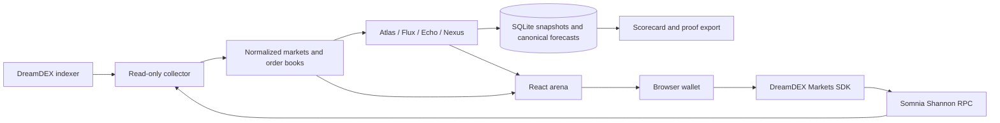

# DreamCurve architecture

## Trust boundaries

- The server only reads public testnet data. It has no signer or private key.
- The browser wallet signs approvals, orders, cancellations and redemptions.
- Demo data is generated in memory, labelled illustrative, never written to SQLite and cannot open a trade ticket.
- A trade re-reads on-chain status, refreshes depth, applies a 2% protective quote bound, checks expiry headroom and validates the receipt.
- A transaction receipt proves execution of the transaction, not necessarily a complete fill. The UI reports zero fills separately.
- Canonical forecast rows are immutable at the database layer. Their SHA-256 digest is useful for comparing exports, but is not an on-chain timestamp commitment.

## Runtime

One Node service hosts the React production build, public read-only API, collector and SQLite adapter. On Railway, mount a persistent volume and point `DATABASE_PATH` to a file within that volume. The app can later move forecasts to Postgres without changing the domain model.
